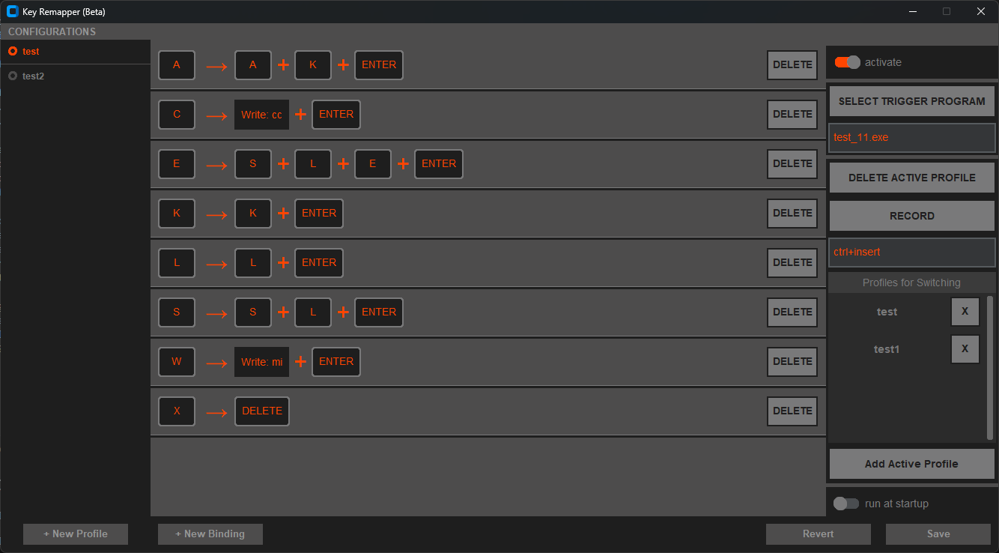
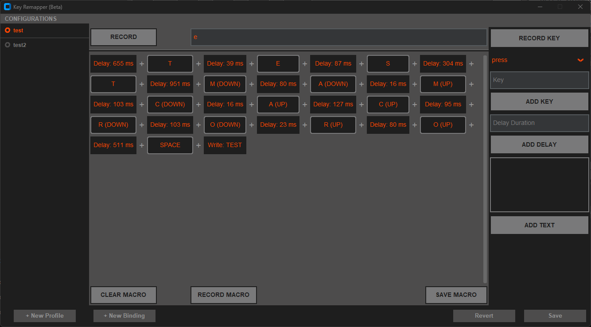

# KeyRemapper

KeyRemapper is a program that allows users to remap keyboard keys. This program is useful for users who want to automate repetitive tasks.

## Features

* Remaps keyboard keys
* Records keyboard events and saves them as a macro
* Replays recorded macros automatically
* Allows users to record a combination or a single word by pressing keyboard keys
* Manages user profiles and stores macro recordings

#### Main Page

The main page shows the program's main interface. Users can record macros, view recorded macros, and manage their profiles from this page.

#### Macro Recording

The macro recording page provides the necessary tools for users to record keyboard events. Users can record a combination or a single word by pressing keyboard keys on this page.